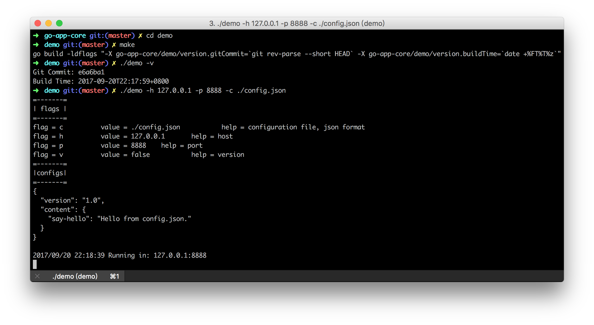
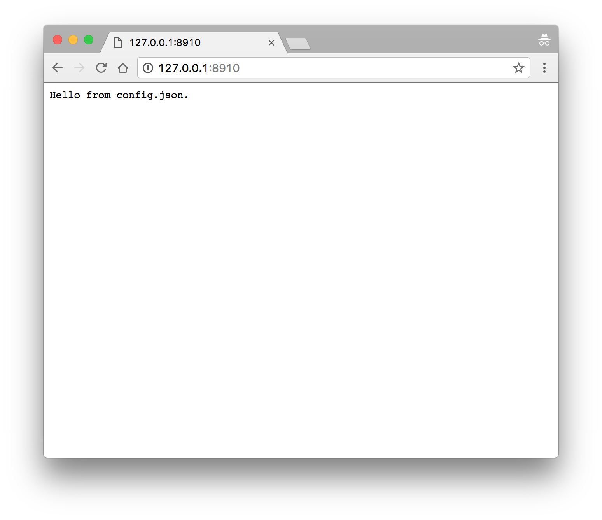

<h1>Go Application Core</h1>

本项目为 Go 程序提供基本的配置文件管理和命令行参数管理等功能，追求 Go 编程最佳实践

### 具体使用方法

#### Step 1：编译
```bash
cd demo/
make
./demo -h 127.0.0.1 -p 8888 -c ./config.json
```
查看编译版本

```bash
➜ ./demo -v
Git Commit: e6a6ba1
Build Time: 2017-09-20T19:23:19+0800
```

### Step 2：启动
```bash
➜ ./demo.go
=-------=
| flags |
=-------=
flag = c          value = config.json     help = configuration file, json format
flag = h          value = localhost       help = host
flag = p          value = 8910    help = port
flag = v          value = false           help = version
=-------=
|configs|
=-------=
{
  "version": "1.0",
  "content": {
    "say-hello": "Hello from config.json."
  }
}

2017/09/20 19:22:21 Listening on: localhost:8910
```

### 从 config.json 文件读取配置

如果我们有一个 config.json 如下：
```json
{
    "version": "1.0",
    "content": {
        "say-hello": "Hello from config.json."
    }
}
```
使用这个语句来读取。
```go
content, _ := common.GetConfigByKey("content.say-hello")
```
如你所见，它支持点号分隔的取法。

### 截图

#### 终端操作


#### 浏览器



> 任何想法都可以[告诉我](https://github.com/tmpbook/go-app-core/issues/new)